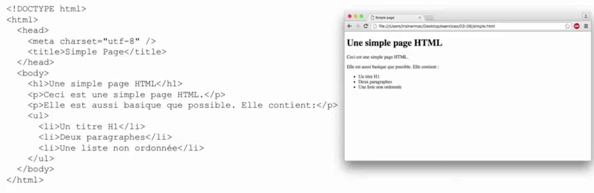
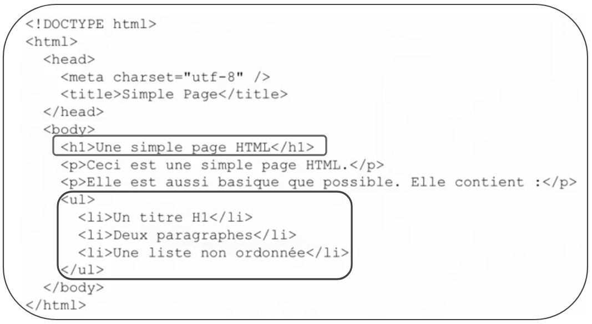
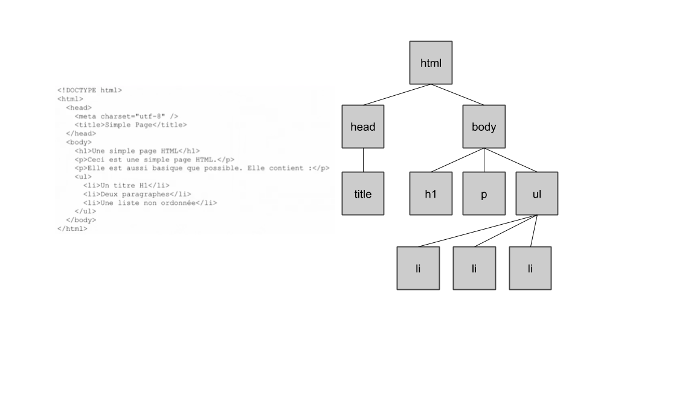
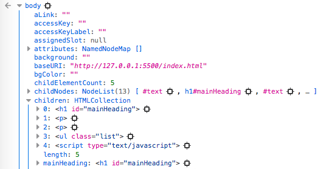
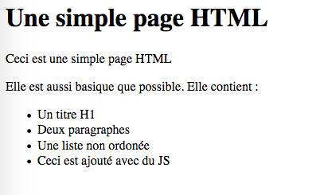

# Document Object Model | DOM

## Définir ce qu'est le DOM

Jusqu'à présent, nous avons manipuler les bases de javascript. C'est bien, ça permet de comprendre les concepts fondamentaux.

Cependant, n'oublions pas que javascript s'execute dans un contexte, et ce fameux contexte c'est la page web.

Le **DOM** est composé de 3 mots

-   Document
-   Object
-   Model

Nous allons maintenant comprendres chacun de ces 3 mots.

### Document

Le `document` c'est la page web. Mais comment javascript voit-il notre page ?



Comme sur l'image de gauche ? de droite ?

Aucune des 2. Il s'agit de 2 points de vue différents sur la même réalité. A gauche tel que le navigateur reçoit les informations. À droite tel que l'utilisateur voit le contenu.
Le javascript comprend notre page comme une collection d'objets.

### Object

C'est quoi un objet ?

On a déjà travaillé avec les objets :

<details>
<summary>Exemple</summary>

-   un array
-   un nombre
-   une date

</details>

De plus, on a créé nos propres objets.

---

Un objet, c'est une chose.

Et dans notre cas, c'est un titre \<h1>, un \<ul> voir même le document complet qui lui aussi est un objet.



Ça vous choque que les li soit dans un ul ? Que le h1 est dans le body ?
Dans le même registre, un objet, peut contenir sans problème d'autre objet.

### Model

Le modèle c'est une convention, avec ses termes et ses procédure.



Le code HTML est vu comme une structure en arbre avec l'élément HTML comme racine de l'arbre.

🚨 Chaque élément de cet arbre est appelé 'un noeud', en anglais un node.
C'est pas des branches, pas des feuilles encore moins une souche..
Si vous l'appelez comme ça, vous serez tout seul à vous comprendre.
🚨

### Récap

Le `DOM` est une convention qui permet de manipuler des éléments d'une page web.

Maitriser cette convention est considéré par beaucoup comme la compétence la plus importante de tout développeur Javascript.

## Travailler avec les noeuds et les éléments

Voilà notre HTML

```html
<!DOCTYPE html>
<html lang="en">
	<head>
		<meta charset="UTF-8" />
		<meta name="viewport" content="width=device-width, initial-scale=1.0" />
		<title>Simple page</title>
		<script src="alert.js" defer></script>
	</head>
	<body>
		<h1 id="mainHeading">Une simple page HTML</h1>

		<p>Ceci est une simple page HTML</p>

		<p>Elle est aussi basique que possible. Elle contient :</p>

		<ul class="list">
			<li>Un titre H1</li>
			<li>Deux paragraphes</li>
			<li>Une liste non ordonée</li>
		</ul>
	</body>
</html>
```

Maintenant, nous allons inspecter les différents objets du DOM.



L'une des propriétés de cet objet, c'est la propriété `children` qui veut dire enfants.
Nous avons donc une liste des différents enfants de la balise `body`
Nous avons plus bas, le `parentNode` qui indique le parent de la balise `body`.

**Allons voir le H1 et UL !**

## Accèder aux éléments du DOM

Pour accèder à un élément du DOM nous devons connaitre par avance son ID ou sa CLASS pour pouvoir le cibler avec la ligne de code suivante :

```javascript
/* Ici par exemple, nous allons prendre le cas ou nous souhaitons récuperer un id.

Encore faut il le connaitre.*/

let header = document.getElementById("mainHeading");
let ul = document.getElementsByClassName("list");

/*
    Avez vous remarqué la subtilité dans la méthode ?
    getElementById > Element n'a pas de 's'
    contrairement à getElementsByClassName.

    Et oui, un id est unique alors qu'une classe peut être 
    attribué à plusieurs éléments différents !
*/

/* on peut rechercher dans le DOM avec la balise HTML
 qu'on a utilisé pour générer ces élements*/

let li = document.getElementsByTagName("li");
```

## Utiliser querySelector et querySelectorAll

La verison moderne de javascript nous permet d'aller rechercher des éléments du DOM avec des sélécteurs.

```javascript
let header = document.querySelector("#mainHeading");
```

Comme en CSS, nous pouvons pousser les selecteurs assez loin

admettons :

```html
<!DOCTYPE html>
<html lang="en">
	<head>
		<meta charset="UTF-8" />
		<meta name="viewport" content="width=device-width, initial-scale=1.0" />
		<title>Simple page</title>
		<script src="alert.js" defer></script>
	</head>
	<body>
		<h1 id="mainHeading">Une simple page HTML</h1>

		<p>Ceci est une simple page HTML</p>

		<p>Elle est aussi basique que possible. Elle contient :</p>

		<ul class="list">
			<li>Un titre H1</li>
			<li>Deux paragraphes</li>
			<li>Une liste non ordonée</li>
		</ul>
		<footer id="mainFooter">
			<p>Ceci est le footer</p>
		</footer>
	</body>
</html>
```

Pour accèder au p qui se trouve dans le footer il suffit de faire :

<details>
<summary>Faire quoi selon vous ? 😇 </summary>

```javascript
let selected = document.querySelector("#mainFooter p");
```

</details>

---

Et pour pour selectionner plusieurs éléments en même temps c'est le selecteur `querySelectorAll`

```javascript
let selected = document.querySelectorAll(".list li");
```

## Modifier les éléments du DOM

Maintenant qu'on sais recuperer un élément du DOM on être en mesure de travailler avec ces éléments.

par exemple :

```javascript
let header = document.querySelector("#mainHeading");

// Ici je lui indique que j'ajoute un attributs HTML qui est
// align : "right";

header.setAttribute("align", "right");

// fonctionne aussi comme suit
header.align = "right";
```

## Créer de nouveau éléments dans le DOM

Nous allons tenter de créer un une ligne supplémentaire à notre HTML mais unique en JS.

```html
<ul class="list">
	<li>Un titre H1</li>
	<li>Deux paragraphes</li>
	<li>Une liste non ordonée</li>
</ul>
```

Nous allons ajouter un nouveau `li`

Voici la façon de faire.

```javascript
let elementA = document.createElement("li");
let textLabel = document.createTextNode("Ceci est ajouté avec du JS");

elementA.appendChild(textLabel);

document.querySelector(".list").appendChild(elementA);
```

Avez vous compris ? Si oui, bravo ! 👏 👏 👏
Parce que moi, pas vraiment, surtout si je revient dans 3 semaines dessus.

Donc on va commenter !

```javascript
// Creation d'un element li
let elementA = document.createElement("li");
// Creation d'un texte
let textLabel = document.createTextNode("Ceci est ajouté avec du JS");
// J'ajoute l'élément textLabel à l'élément li
elementA.appendChild(textLabel);

// Je recherche la class .list dans mon document, puis j'ajoute l'élément li créé plus tôt
document.querySelector(".list").appendChild(elementA);
```

**Résultat**



## Modifier les styles CSS en Javascript

Bon , on sais chercher un élément, on sais en ajouter, maintenant, pourquoi ne pas changer la couleur de fond ou d'un texte ?

Tout d'abord, nous devons aller chercher l'élément que nous souhaitons modifier.
Ensuite, grâce à la propriété `style` nous pouvons ajouter du style à notre HTML.

```javascript
// Je recupere tout mon body dans la variable body
let body = document.querySelector("body");

// J'informe grâce à la propriété style que je souhaite changer de
// background-color !
body.style.backgroundColor = "#DDD";
```

🚨 Comme vous avez constaté, quand le mot est simple comme `display` ou `align` que ce soit en CSS ou JS c'est la même chose.
Cepedant, quand le mot est composé, comme `background-color` ou `align-items` à ce moment là, nous devons passer cette variable en CamelCase `backgroundColor` ou `alignItems`; N'oublions pas que `-` est considéré comme un opérateur de soustraction en javascipt.
🚨

## Sondage

Dans l'objet `style`, les propriétés ont le nom de la règle de style CSS, sauf si cette règle comporte **\_** dans le CSS.

-   une majuscule
-   un souligné
-   un point
-   un tiret

<details>
<summary>Réponse</summary>
un tiret
</details>

---

Pour créer un texte, on utilise la méthode **\_**.

-   createElement()
-   createTextNode()
-   addElement()
-   addTextNode()

<details>
<summary>Réponse</summary>
createTextNode()
</details>

---

Pour modifier un élément du DOM, on peut utiliser la méthode **\_**.

-   writeElement()
-   setAttribute()
-   setElement()
-   writeAttribute()

<details>
<summary>Réponse</summary>
setAttribute()
</details>

---

Parmi les nouvelles méthodes du DOM, on trouve **\_**.

-   queryCSS()
-   getElementByCSS()
-   getElementBySelector()
-   querySelector()

<details>
<summary>Réponse</summary>
querySelector()
</details>

---

La méthode **\_** permet de rechercher un élément dans le DOM.

-   getElement()
-   getElementById()
-   findElementById()
-   findElement()

<details>
<summary>Réponse</summary>
getElementById()
</details>

---

Les objets du DOM contiennent une propriété **\_**.

-   parent
-   siblingNodes
-   siblings
-   parentNode

<details>
<summary>Réponse</summary>
parentNode
</details>

---

Le JavaScript comprend la page comme **\_**.

-   Des instruction HTML
-   Des paires clé-valeur
-   Une collection d'objets
-   Un tableau de tableaux
<details>
<summary>Réponse</summary>
une collection d'objets
</details>
