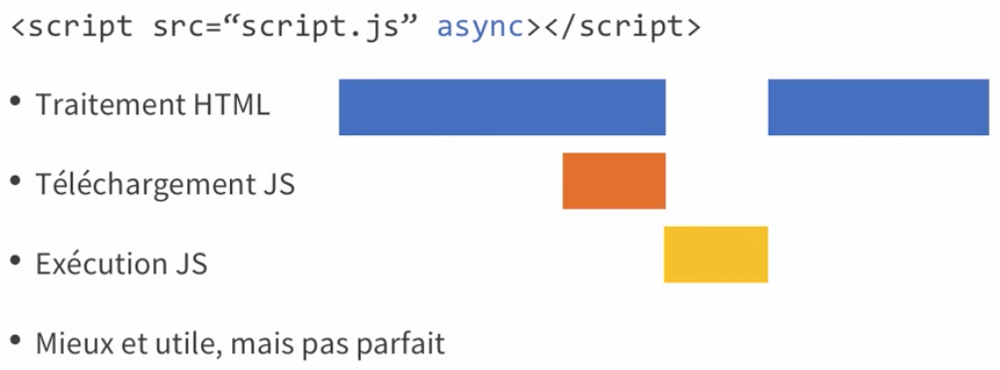
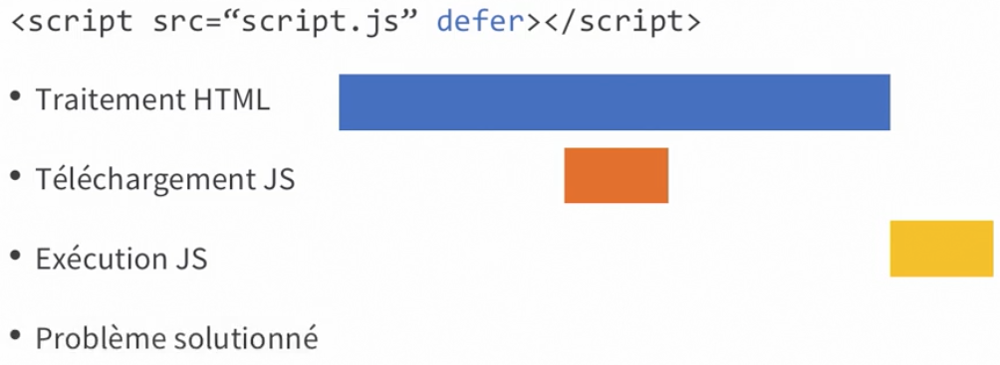

## Architecture HTML avec implémentation de Javascript

```html
<!DOCTYPE html>
<html lang="en">
	<head>
		<meta charset="UTF-8" />
		<meta name="viewport" content="width=device-width, initial-scale=1.0" />
		<title>Document</title>
	</head>
	<body>
		<h1>Hello World</h1>
	</body>
	<script>
		alert("coucou");
	</script>
</html>
```

Nous pouvons (et nous allons utiliser cette façon de faire) déplacer notre javascript ailleurs.

```html
<!DOCTYPE html>
<html lang="en">
	<head>
		<meta charset="UTF-8" />
		<meta name="viewport" content="width=device-width, initial-scale=1.0" />
		<title>Document</title>
	</head>
	<body>
		<h1>Hello World</h1>
		<script src="alert.js"></script>
	</body>
</html>
```

---

Au lieu de faire un alert() qui bloque le process d'éxécution, nous allons utiliser console.log().

Il existe bien d'autre façon d'utiliser l'objet console avec ses autres méthode. voir [ici](https://developer.mozilla.org/fr/docs/Web/API/Console).

Quelques exemple :

```javascript
console.log("coucou");
console.info("c'est");
console.warn("anthony");
console.error("le formateur");
```

## Charger Javascript de manière asynchrone et différée






### Rappel des commentaires sur Javascript

```javascript
// ceci est un commentaire sur une ligne

/*
 Ceci est un commentaire
 sur plusieurs lignes
*/
```

Il est très important de commenter son code en javascript !

# Sondage !

---

Un commentaire sur une ligne en JavaScript commence par **\_**.

-   //
-   \#
-   \--
-   %

<details>
  <summary>Réponse</summary>
//
</details>

---

Pour charger un fichier JavaScript avec la garantie que le code HTML aura été complètement chargé auparavant, on utilise le mot-clé **\_**.

-   await
-   defer
-   delay
-   postload

<details>
  <summary>Réponse</summary>
defer
</details>

---

ES 6 propose le mot-clé **\_** sur la balise script, qui nous permet de demander le téléchargement des fichiers JavaScript en parallèle du traitement de l'HTML.

-   async
-   spawn
-   await
-   parallel

<details>
  <summary>Réponse</summary>
async
</details>

---

La propriété **\_** permet de se référer au contenu d'une balise HTML.

-   .HTMLContent
-   .value
-   .element
-   .innerHTML

<details>
  <summary>Réponse</summary>
.innerHTML
</details>

---

Pour afficher des messages en débogage, on utilise la commande **\_**.

-   alert.console
-   alert.log
-   console.log
-   console.alert

<details>
  <summary>Réponse</summary>
console.log
</details>

---

Pour charger un fichier JavaScript dans la balise `<script>`, on utilise l'attribut **\_**.

-   src
-   file
-   from
-   js

<details>
  <summary>Réponse</summary>
src
</details>

---

Pour exécuter du code JavaScript avec Live Server, on appuie sur le bouton **\_**.

-   Start Server
-   Execute JS
-   Go Live
-   Run Browser

<details>
  <summary>Réponse</summary>
Go Live
</details>
