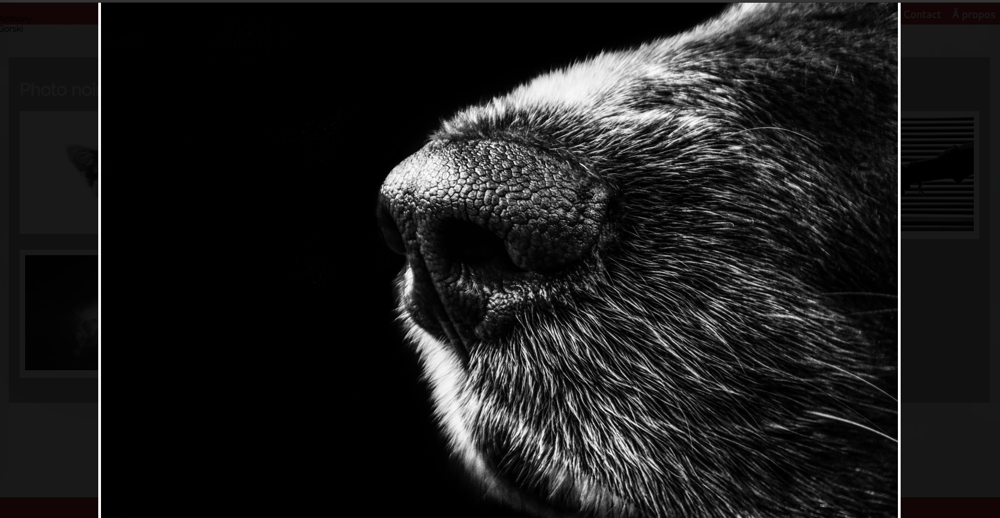

# Les évènements de Javascript

## Comprendre le rôle des évènements

La véritable puissance de Javscript va vous apparaître, quand vous saurez exécuter des fonctions Javascript en réponse à un évènement.

Il y a énormément d'évènement, je vais en lister quelques'unes

-   onLoad
-   onMousemove
-   onMouseout
-   onScroll
-   onClick
-   onFocus
-   onSubmit

etc.

La plupart des évènements passerons inaperçus mais nous devons être capable d'intercepter cet événement et d'éxécuter une fonction Javascript en réponse à l'évènement.

On va doute écouter le DOM et attendre que l'événement auquel nous voulons réagir se produise.
À se moment la on éxécutera une fonction, et cette fonction est appelée `Un gestionnaire d'évènement` ou `Event handler`.

Entrons dans le détail.

## Réagir à des évènements

Nous allons faire un cas pratique.

J'ai une galerie de photo, le but : Quand je clique sur la photo, je souhaite que celle ci s'agrandisse.


pour ce faire prenons juste le code suivant :

```html
<main id="singleGallery">
	<h1>Photo noir/blanc</h1>
	<ul>
		<li>
			
		</li>
		<li></li>
		<li></li>
		<li></li>
		<li></li>
		<li></li>
		<li></li>
		<li></li>
	</ul>
</main>
```

C'est exemple fonctionne, mais c'est pas propre. On mélange HTML avec du JS en plein milieu. De plus, ce morceau de code n'est pas réutilisable est n'est bon QUE pour le 1er élément.

On va préférer la solution d'externaliser le code javascript.

```javascript
// Ici, grâce à querySelectorAll, j'indique que je souhaite toutes les images
// dont l'id est singleGallery
let galImages = document.querySelectorAll("#singleGallery img");
// La boucle for .. of est similaire à la boucle for .. in
// Pour chaque image de galImages
for (image of galImages) {
	// au clique tu fais la fonction suivante
	image.onclick = function () {
		// dire "bonjour toi !"
		alert("boujour toi !");
	};
}
```

⚠️ Il y a quand même une limitation, imaginons que je souhaite faire 2 fonction différente pour 1 seul clique.

```javascript
let galImages = document.querySelectorAll("#singleGallery img");
for (image of galImages) {
	image.onclick = function () {
		alert("boujour toi !");
	};
	image.onclick = function () {
		alert("au revoir !");
	};
}
```

Alors c'est la derniere fonction qui est appelé (car elle écrase l'instruction précédente) ⚠️

💡 Nous avons une fonction anonyme

```javascript
let galImages = document.querySelectorAll("#singleGallery img");
for (image of galImages) {
	// fonction anonyme ici
	/* donc on passe de ça : 
        image.onclick = function () {
            alert("boujour toi !");
        };
        à ça :
    */
	image.onclick = () => {
		alert("bonjour toi !");
	};
}
```

## Utiliser addEventListener

Alors cette méthode fonctionne, c'est top ! Elle a cependant certaine limite, comme le faite de pas pouvoir chaîner deux évènement click par exemple.

Alors on va modifier un peu le code et apprendre une méthode du DOM `addEventListener`.

```javascript
// Ici, grâce à querySelectorAll, j'indique que je souhaite toutes les images
// dont l'id est singleGallery
let galImages = document.querySelectorAll("#singleGallery img");

// Une boucle simple suffit
// galImages.length est égal à la longueur total de mon tableau galImages
for (let i = 0; i < galImages.length; i++) {
	let image = galImages[i];
	//Ici on ajout "l'écouteur d'évènement" - click
	/* cette méthode à besoin de 3 paramètres
        1: l'évènement
        2: la fonction à éxécuter
        3: Un boolean qui permet de faire de l'event bubling 
        c'est pour les avancées ++
    
    */
	image.addEventListener(
		"click",
		() => {
			alert("Coucou !");
		},
		false
	);
	image.addEventListener(
		"click",
		() => {
			alert("Coucou !");
		},
		false
	);
}
```

Le gros avantage, c'est qu'avec cette méthode, je peux cumuler les évènements, même si elle sont identique.

```javascript
image.addEventListener(
	"click",
	() => {
		alert("Coucou !");
	},
	false
);
image.addEventListener(
	"click",
	() => {
		alert("au revoir !");
	},
	false
);
```

C'est de cette manière que les développeus JavaScript intéragisse avec le DOM.

## Inspecter les propriétés des évènements

Bon les alert, c'est cool pour voir si ça fonctionne, mais maintenant, nous allons faire notre agrandissement de l'image.

```javascript
let galImages = document.querySelectorAll("#singleGallery img");
for (let i = 0; i < galImages.length; i++) {
	let image = galImages[i];
	image.addEventListener("click", showSinglePict(), false);
}

/*
    En javascript tout est objets !  Même les évènements !
*/
// ici, on l'appele 'event'. Vous verez souvent 'e' ou 'ev'
function showSinglePict(event) {
	// console.log(event);
	let image = event.target;
}
```

Il y a un problème sur la variable image la non ?

<details>
<summary>?</summary>

Et bien non ! Car le mot clé `let` oblige la variable à rester dans son bloc d'insctruction.

C'est à dire que la variable `image` qui se trouve dans le `for` est différent de la variable `image` dans la fonction `showSinglePict()`.

</details>

## Utiliser l'évènement CLICK

Ok, maintenant notre galeries commence à ressembler à quelque chose..
Nous allons faire l'instruction : Quand on clique sur une image, celle ci s'agrandit pour être en gros sur l'écran.

Retournons sur la page HTML `singleGallery.html` et décortiquons là..

```html
<footer id="mainFooter">
	<p>&copy; copyright Anthony Gorski - 2020</p>
</footer>
<figure id="galleryContainer"></figure>
```

Ici nous avons une balise `figure` avec comme id `galleryContainer` et cette figure contient une image avec des attributs vide.

Voyons son style CSS.

```css
#galleryContainer {
	[...]
	visibility: hidden;
	opacity: 0;
}
#galleryContainer .visible {
	visibility: visible;
	opacity: 1;
}
```

Nous pouvons voir que notre figure par défaut elle est invisible, grâce à `visibility: hidden;` et `opacity: 0;` si on applique la classe `visible` alors l'image a pour visibilité `visibility: visible;`et `opacity: 1;`.

Pour récapituler, c'est en méttant ou retirant la classe `visible`de l'élément figure qu'on va pouvoirr afficher ou masquer cet élément.

On peut modifier notre Javascript.

```javascript
let galImages = document.querySelectorAll("#singleGallery img");

for (let i = 0; i < galImages.length; i++) {
	let image = galImages[i];
	//Ici on ajout "l'écouteur d'évènement" - click
	/* cette méthode à besoin de 3 paramètres
        1: l'évènement
        2: la fonction à éxécuter
        3: Un boolean qui permet de faire de l'event bubling 
        c'est pour les avancées ++
    */
	/* 	1: l'événement c'est "au click"
		2: la fonction c'est "showSinglePict"
		3: on laisse à false
	 */
	image.addEventListener("click", showSinglePict, false);
}

/*
	Détail de la fonction showSinglePict()
*/
function showSinglePict(event) {
	// On récupère le targer de l'evenement
	let image = event.target;
	// On séléctionne l'id galleryContainer
	let imageContainer = document.getElementById("galleryContainer");
	// ici in informe qu'on souhaite dans cette élément le selector img
	let bigPict = imageContainer.querySelector("img");

	// grâce à ça, on dit que la source de l'image c'est l'image cliqué
	bigPict.src = image.src;
	/* On ajoute la méthode toggle de la propriété classList*/
	imageContainer.classList.toggle("visible");
}
```

💡 to toggle en anglais c'est "allumer" si éteint et "éteindre" si allumé.

Donc dans notre cas, ajoute `visible` si c'est pas présent, ou enlève `visible`si présent.

Ok ça marche, mais on peut pas fermer l'image ouverte !
C'est pas grave, un coup de JS et c'est bon !

```javascript
function showSinglePict(event) {
	let image = event.target;
	let imageContainer = document.getElementById("galleryContainer");
	let bigPict = imageContainer.querySelector("img");

	bigPict.src = image.src;
	imageContainer.classList.toggle("visible");
	// on ajoute un ecouteur d'événement
	// et ici on dit que 'au click, tu appeles la fonction closeSinglePict
	imageContainer.addEventListener("click", closeSinglePict, false);
}

// et la fonction closeSinglePict
function closeSinglePict() {
	// va chercher l'imageContainer
	let imageContainer = document.getElementById("galleryContainer");
	// et on toggle la class visible
	imageContainer.classList.toggle("visible");
}
```

résultat :



## Se servir des timers

Il existe en Javascript des méthodes qui permettent de gérer encore mieux nos événements.

-   setTimeOut()
-   setInterval()

#### setTimeOut()

Cette méthode permet de différer l'éxécution d'un script d'un certain nombre de milisecondes

```javascript
setTimeOut(() => {
	console.log("coucou ! mais avec 1 seconde de retard !");
}, 1000);
```

#### setInterval()

Cette méthode permet de répéter une même action à intervalles réguliers.

```javascript
setInterval(() => {
	console.log("coucou ! mais avec 1 seconde de retard !");
}, 1000);
```

On peut arréter la fonction `setInterval`
Celle ci renvoi une valeur qui peut être stocké

ex :

```javascript
let interval = setInterval(() => {
	console.log("coucou ! mais avec 1 seconde de retard !");
}, 1000);

setTimeOut(() => {
	clearInterval(interval);
}, 5000);
```

Dans ce cas il va ce passer 5 seconde avant que le setInterval() s'arrete car le setTimeOut() va clear l'interval lui même.

## Sondage

Pour attendre, on utilise la fonction **\_**.

-   timer()
-   setTimeOut()
-   delay()
-   waitFor()

<details>
<summary>Réponse</summary>
setTimeOut()
</details>

---

Pour ajouter un élément HTML, on utilise **\_**.

-   appendElement()
-   createElement()
-   addElement()
-   newElement()

<details>
<summary>Réponse</summary>
createElement()
</details>

---

Pour afficher un élément `figure`, on peut utiliser **\_**.

-   image.toggle()
-   classList.toggle()
-   classList.show()
-   image.show()

<details>
<summary>Réponse</summary>
classList.toggle()
</details>

---

Les évènements sont des objets.

-   VRAI
-   FAUX

<details>
<summary>Réponse</summary>
VRAI

En javascript, TOUT est objet !

</details>

---

Pour ajouter un gestionnaire d'évènements, on utilise la méthode **\_**.

-   addEventHandler()
-   newEventHandler()
-   addEventLister()
-   newEventLister()

<details>
<summary>Réponse</summary>
addEventLister()
</details>

---

Le clic déclenche l'évènement **\_**.

-   onclick
-   buttonclick
-   mouseclick
-   onmouse

<details>
<summary>Réponse</summary>
onclick
</details>

---

Pour écouter un évènement, on crée **\_**.

-   un anonyme
-   un Event Handler
-   une boucle
-   un délégué

<details>
<summary>Réponse</summary>
un Event Handler
</details>
