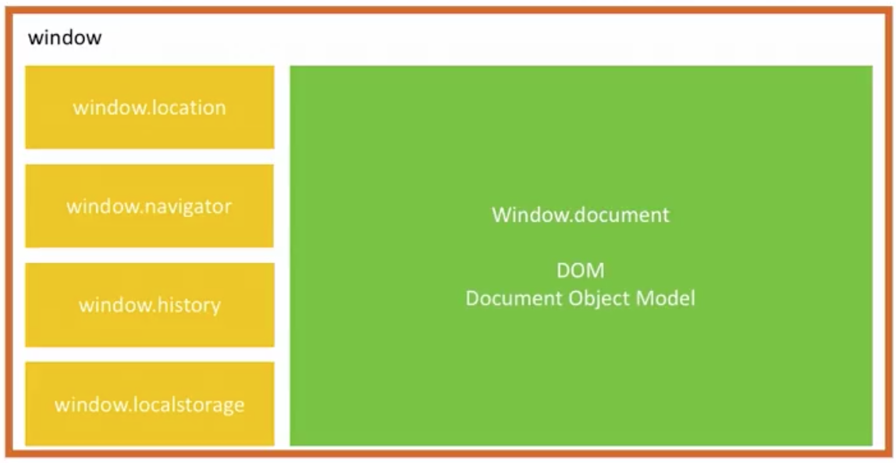

# Découvrir les objets de javascript

## Découvrir l'objet MATH

Javascript propose une série d'objet qui sont nativement disponible, pas besoin de les déclarer, pas besoins d'y introduire des propriétés. C'est objets sont la tout simplement !

EX :

```javascript
var myNumber;

// PI est une constante disponible dans l'objet Math
myNumber = Math.PI;

console.log(myNumber); // 3,141592...
```

En plus des constantes, nous avons aussi des `méthodes`.

Une méthode est une fonction associé à un objet.

```javascript
var a = 5,
	b = 2.2,
	c = 18;
var myNumber;

// max est une fonction, donc il faut des parenthèses
myNumber = Math.max(a, b, c);

// renvoi le plus petit nombre passé en paramètre
myNumber = Math.min(a, b, c);

// renvoi la valeur arrondie suppérieur / inférieur ça dépend de la décimale
myNumber = Math.round(b); // 2

// force l'arrondie suppérieur
myNumber = Math.ceil(b); // 3

// force l'arrondie inférieur
myNumber = Math.floor(b); // 2

// retourne un nombre aléatoire entre 0 et 1
myNumber = Math.random(); // 0.35

console.log(myNumber); // 18
```

## Travailler avec l'objet DATE

```javascript
let today = new Date();
let birthday = new Date(1992, 06, 17);

console.log(today); // Thu Oct 29 2020 11:08:06 GMT+0100 (heure normale d’Europe centrale)
console.log(birthday); // Fri Jul 17 1992 00:00:00 GMT+0200 (heure d’été d’Europe centrale)
```

Il y a plusieurs méthode associé avec l'objet `Date()`. N'hésitez pas à aller voir la doc sur Mozilla [ici](https://developer.mozilla.org/fr/docs/Web/JavaScript/Reference/Objets_globaux/Date)

Quelques exemples :

```javascript
let today = new Date();
let birthday = new Date(1992, 06, 17);

console.log(today.getDate()); //29

console.log(birthday.getDay()); // 5
```

#Question: À votre avis, à quoi correspond le chiffre `5`

<details>
<summary>Réponse</summary>
getDay() est un entier correspondant au jour de la semaine (0 correspondant à dimanche, 1 à lundi, 2 à mardi et ainsi de suite) de la date indiquée selon l'heure locale.

Donc pour notre exemple, 5 qui correspond au Vendredi.

</details>

### Go tester !

## Revisiter les chaînes de caractères

En javascript, TOUT est objet. Même les chaînes de caractère.

Ex :

```javascript
let firstName = "anthony";

console.log(firstName); // anthony
```

Enfaite, la variable firstName est un objet 😱 !

Et oui, et donc vu que c'est un objet, elle a forcément des `propriété` et des `méthodes`.

Pour les strings, on a une propriété intéréssante c'est la méthode `length`.

```javascript
let firstName = "Anthony";

console.log(firstName.length); // 7
console.log(firstName.toUpperCase()); // ANTHONY
console.log(firstName.toLowerCase()); // anthony
```

Pour en savoir plus [ici](https://developer.mozilla.org/fr/docs/Web/JavaScript/Reference/Objets_globaux/String) ou [là](https://www.w3schools.com/js/js_string_methods.asp)

## Employer l'objet Number

En javascript, TOUT est objet. Comme pour les chaînes de caractères, les nombres en font parti.

```javascript
let myNumber = 82;
let my2Number = 82.5;
// on a l'objet Number, c'est comme pour Math. Il existe
// nativement en js.
myNumber = Number.MAX_VALUE;
myNumber = Number.MIN_VALUE;

console.log(Number.isInteger(myNumber)); // true
console.log(Number.isInteger(my2Number)); // false

// myNumber a aussi ses propriétés
console.log(myNumber.toString()); // "82"
```

## Redécouvrir l'objet ARRAY

En javascript, TOUT est objet. (Vous l'avez en tête maintenant ? 😝 )

```javascript
let colors = ["Rouge", "Vert", "Bleu"];

console.log(colors.length); // 3

console.log(colors.join()); // Rouge,Vert,Bleu

console.log(colors.join("-")); // Rouge-Vert-Bleu

/*
    On va ajouter un nouvel élément : 
    pour ce faire on utilise la méthode PUSH */

colors.push("Orange");

console.log(colors); // ["Rouge", "Vert", "Bleu", "Orange"]
/*
    On remarque que l'élément ajouté est à la fin du tableau, 
    si nous voulons le mettre devant. Il suffit d'utiliser UNSHIFT

*/
colors.unshift("Orange");

console.log(colors); // ["Orange", "Rouge", "Vert", "Bleu"]

/*
Il existe aussi la méthode SHIFT
qui enlève le 1er élément du tableau
*/

colors.shift();

console.log(colors); // ["Vert", "Bleu"]

/*
Inversemment, si vous souhaitez enlever le dernier
Il faut utiliser la méthode POP
*/

colors.pop();

console.log(colors); // ["Rouge", "Vert"]
```

## S'initier au BOM

Vous connaissez maintenant les objets les plus courant de JS.
Vous savez aussi que TOUS ont des propriétés et des méthodes.
Et vous savez aussi que tout est objet.. Absolument TOUT !


-   L'écran de l'ordinateur est un objet.
-   Le navigateur aussi est un objet
-   Et le document chargé dans l'ordinateur est aussi un objet.

Bien sûr, tout ces objets ont des propriétés et des méthodes.

Leurs propriétés permet d'obtenir des informations sur ces différents objets, et leurs méthodes nous permettent d'interagir avec ces objets.

On appelle ça le **Browser Object Model** ou **BOM**

L'objet le plus haut de la hiérarchie est l'objet `window`



On trouve à l'intérieur de cette objet

-   window.location
    -   Permet d'interagir avec l'URL
-   window.navigator
    -   Représente le navigateur en tant que tel.
-   window.history
    -   Trace l'historique de navigation de l'internaute
-   window.localStorage
    -   Vous propose un mécanisme de stockage de données en local.

La plupart du temps vous n'aurez pas forcément besoin d'interagir avec, il a cependant une exception à la règle.. C'est l'objet `document`

Cet objet `document` représente la page HTML chargée dans le navigateur qui est visible actuellement par l'internaute.

L'objet `document` est tellement important qu'il a été modélisé et que ce modèle porte le nom de **DOM** pour **Document Object Model**

🚨 Il est important de savoir que le BOM ne fait pas l'objet d'une convention strictement suivie par tout les navigateurs.

Ça veut dire que chaque navigateur est libre d'implémenter le BOM un peu comme il le souhaite.

Contrairement au DOM qui, lui, fait _l'objet_ d'une convention respectée par tout les navigateurs.

🚨

## Expérimenter avec les objets WINDOW et NAVIGATOR

Allons voir sur nos navigateur l'objet `window`. Il y a plein de chose, et encore plus de choses sur on affiche ce qu'elles possèdes.

Nous allons tester :

```javascript
console.log(window.location);
```

window.location, c'est lui-même un objet qui a ses propres propriétés et ses propres méthodes.

-   hostname (l'hôte, le nom du site que nous sommes en train de visiter)
-   pathname (le chemin d'accès sur le site que nous sommes en train de visiter)
-   port (le port HTTP qu'on utilise)

Et des méthodes

-   reload (qui permet de recharger la page que nous sommes en train de visiter)

```javascript
console.log(window.navigator);
```

window.navigator, c'est lui-même un objet qui a ses propres propriétés et ses propres méthodes.

il permet d'avoir plein d'information sur le navigator qu'on utilise et sur le système que l'on utilise pour visionner la page web.

-   appCodeName (Le navigateur)
-   appName (Netscape)
-   language (la langue du navigateur)
-   oscpu
-   etc

```javascript
console.log(window.document);
```

window.document, represente la page HTML et c'est aussi un objet qui a ses propres propriétés et ses propres méthodes.

Cet objet est tellement important, qu'on a pas besoin de marquer window devant.

## Sondage

L'URL est représentée par l'objet window.**\_**.

-   path
-   location
-   url
-   address

<details>
<summary>Réponse</summary>
location
</details>

---

L'objet le plus élevé de la hiérarchie du BOM est l'objet **\_**.

-   window
-   page
-   document
-   navigator

<details>
<summary>Réponse</summary>
window
</details>

---

Pour créer une chaîne de caractères à partir d'un `array`, on utilise la méthode **\_**.

-   join()
-   cast()
-   extract()
-   string()

<details>
<summary>Réponse</summary>
join()
</details>

---

Le nombre le plus élevé possible est représenté dans la constante **\_**.

-   Math.TOP_VALUE
-   Math.MAX_VALUE
-   Number.TOP_VALUE
-   Numer.MAX_VALUE

<details>
<summary>Réponse</summary>
Numer.MAX_VALUE
</details>

---

Un objet string comporte la propriété **\_**.

-   size
-   len
-   width
-   length

<details>
<summary>Réponse</summary>
length
</details>

---

En JavaScript, le premier mois est de numéro **\_**.

-   12
-   0
-   01
-   1

<details>
<summary>Réponse</summary>
0
</details>

---

L'objet `Math` comporte la méthode **\_**.

-   rnd()
-   split()
-   rev()
-   ceil()

<details>
<summary>Réponse</summary>
ceil()
</details>
